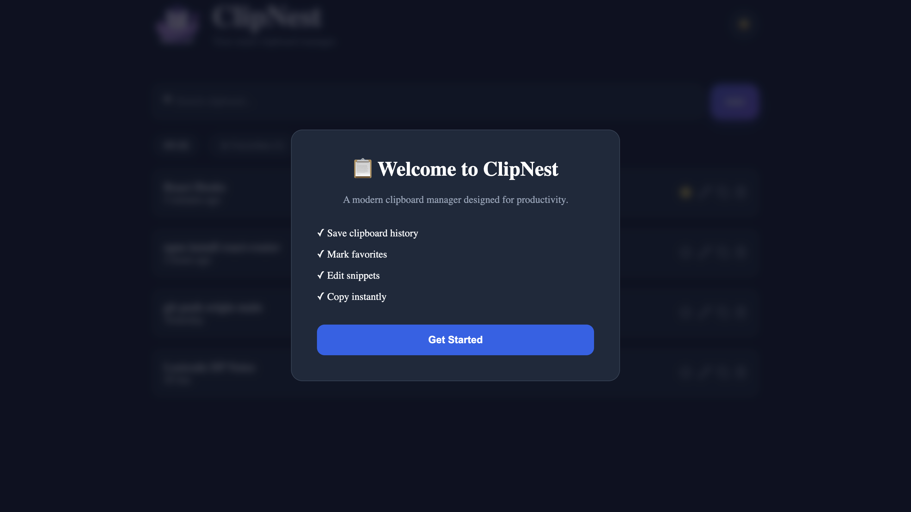
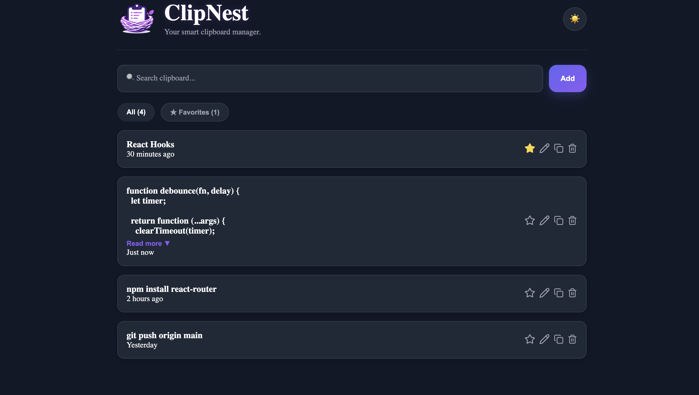
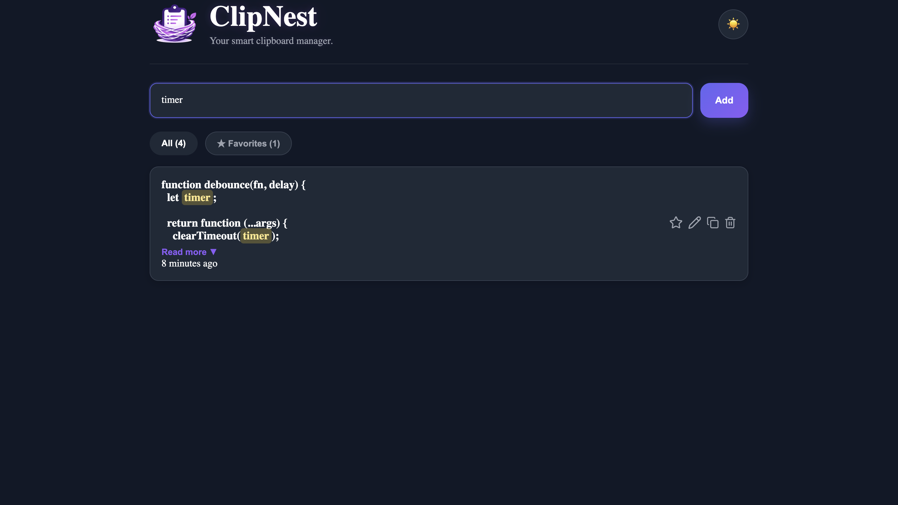
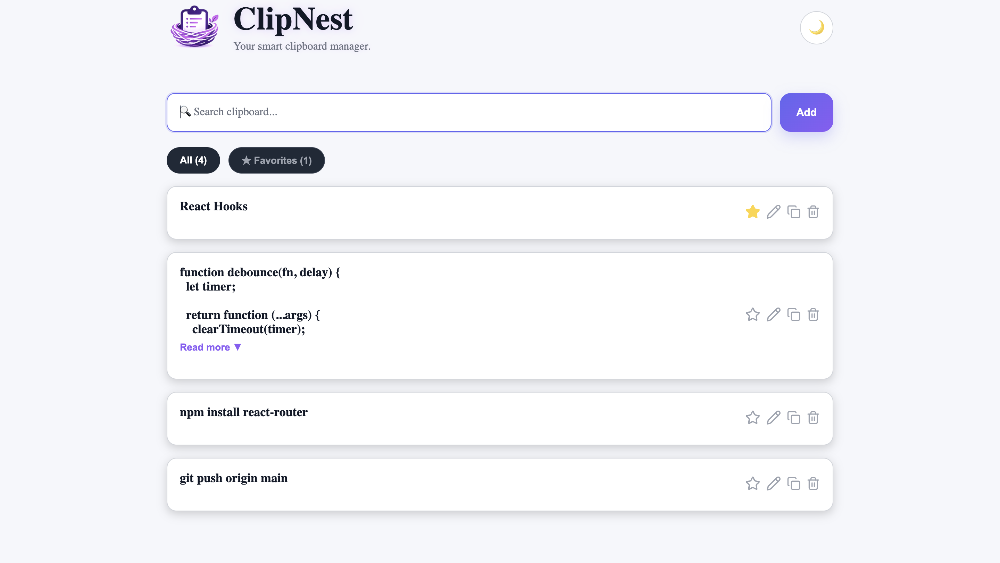
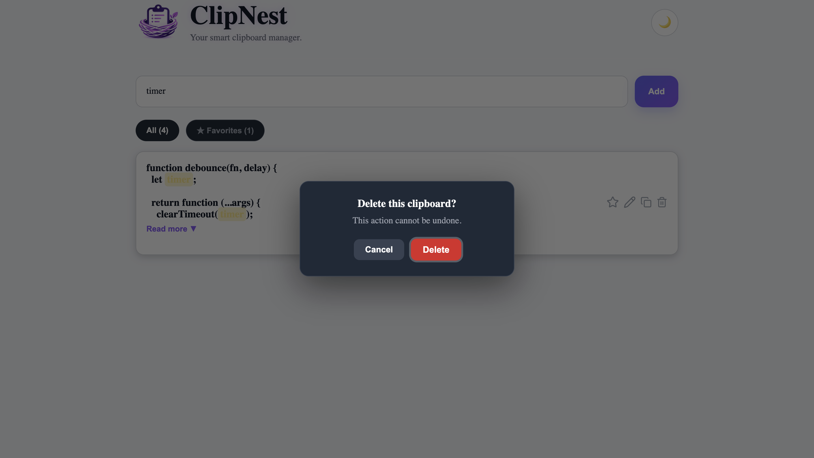

# 📋 ClipNest — Smart Clipboard Manager

A modern clipboard manager built with **React**, **TypeScript**, and **Vite** that enables users to save, organize, search, and manage frequently used text snippets efficiently.

## 🚀 Live Demo

🔗 https://clip-nest-tan.vercel.app

---

## Overview

ClipNest is a lightweight clipboard management application designed to improve productivity by providing a clean interface for storing and organizing copied text. The application supports real-time search, favorites, editing, responsive layouts, theme switching, and persistent local storage.

---

## Features

- Save and manage clipboard snippets
- Real-time search with highlighted matches
- Mark frequently used snippets as favorites
- Edit existing clipboard entries
- Delete unwanted snippets
- Copy snippets back to the clipboard with a single click
- Expand and collapse lengthy snippets using a **Read More / Show Less** option
- Automatic relative timestamps (e.g., *2 minutes ago*)
- Persistent storage using LocalStorage
- Light and Dark theme support
- Fully responsive user interface

---

# Screenshots

## Welcome Screen



## Dark Theme



## Search & Read More



## Light Theme



## Delete Confirmation



---

## Technology Stack

Frontend
- React
- TypeScript
- Vite

Styling
- CSS

Icons
- Lucide React

Storage
- LocalStorage API

---

## Installation

Clone the repository:

```bash
git clone https://github.com/Samridhi4011/ClipNest.git
```

Navigate to the project directory:

```bash
cd ClipNest
```

Install dependencies:

```bash
npm install
```

Start the development server:

```bash
npm run dev
```

Build the production version:

```bash
npm run build
```

---

## Project Structure

```
src/
│
├── assets/
├── components/
├── data/
├── pages/
├── styles/
├── utils/
│
├── App.tsx
└── main.tsx
```

---

## Key Highlights

- Responsive design for desktop and mobile
- Dark and Light mode support
- Persistent clipboard history using LocalStorage
- Fast real-time search with highlighted matches
- Clean and intuitive user interface

---

## Future Enhancements

- Cloud synchronization
- Categories and tagging
- Global clipboard monitoring
- Import and export clipboard history
- Keyboard shortcuts
- Desktop application using Electron
- User authentication and backup

---

## Author

**Samridhi Singh**

GitHub: [Samridhi4011](https://github.com/Samridhi4011)